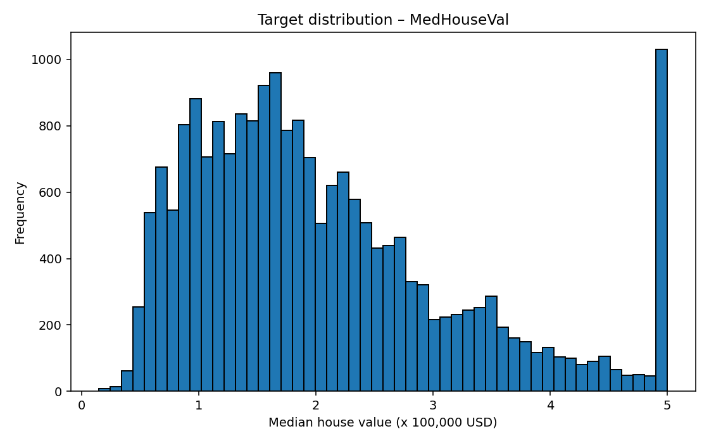
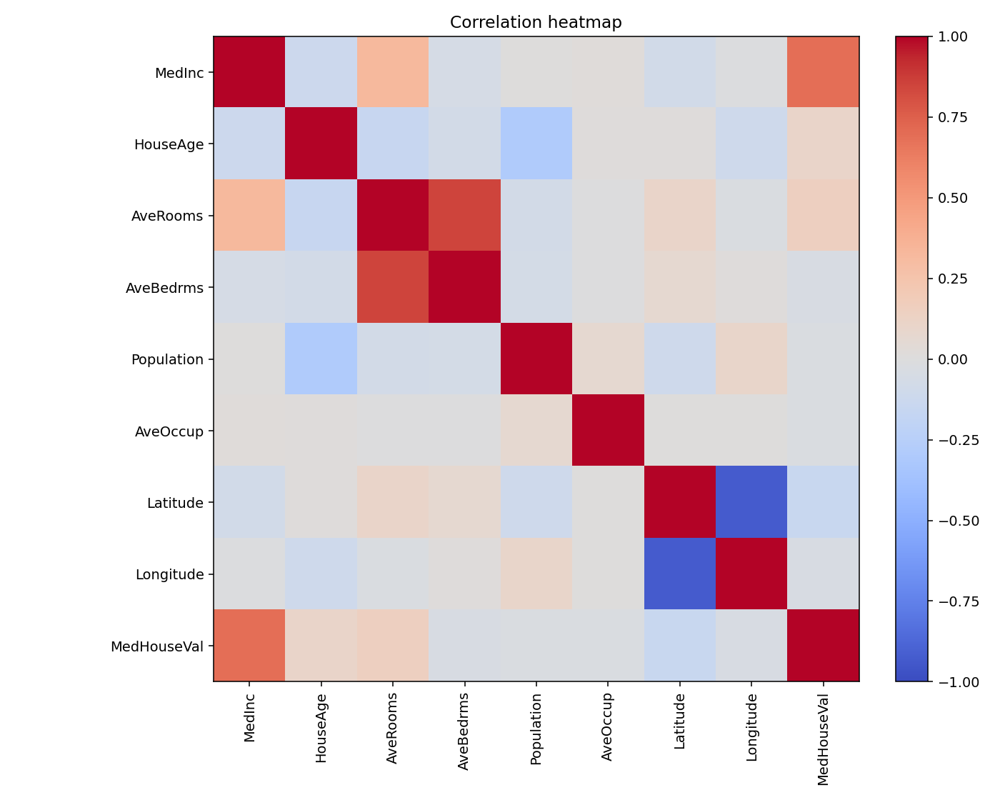
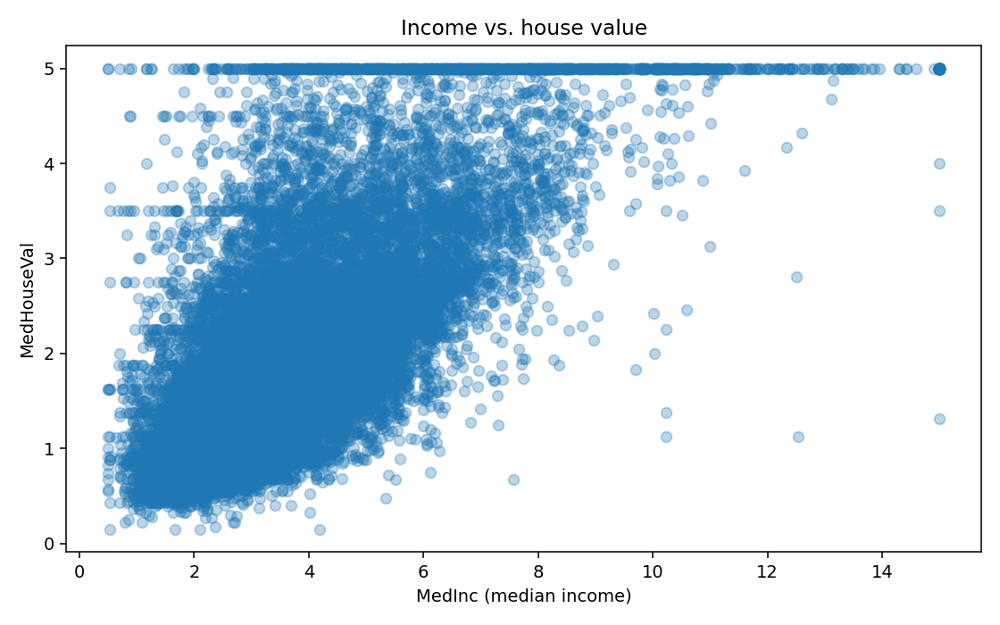

# 🏠 California Housing Price Prediction (ML + API)

End‑to‑end, **resume‑ready** machine learning pipeline for **house price prediction** on the classic California Housing dataset — including EDA, model comparison, model persistence, CLI prediction script, and a production‑style FastAPI service with Swagger docs.

---

## 1. Overview

This project is designed so you can confidently walk an interviewer through a complete ML workflow:

- **Problem:** Predict median house value (in \$100,000) for districts in California.
- **Data:** ~20k samples, 8 numeric features (median income, house age, average rooms, etc.).
- **Models:**
  - `LinearRegression` (raw features)
  - `LinearRegression` with `StandardScaler` in a `Pipeline`
  - `RandomForestRegressor` baseline
  - `RandomForestRegressor` tuned with `GridSearchCV`
- **Metrics:** MSE, RMSE, MAE, R² on a held‑out test set.
- **Risks handled:** data leakage, overfitting; and a discussion starting point for model/data drift.
- **Interfaces:** CLI predictor + FastAPI HTTP API (with auto‑generated Swagger docs).
- **Quality:** small but real test suite with `pytest`.

### 🔢 Quick Results (Test Set)

Best model: **RandomForestRegressor (tuned with GridSearchCV, cv=3)**

- **RMSE:** `0.5039`
- **MAE:**  `0.3266`
- **Target:** `MedHouseVal` (units: 100,000 USD)

See [5. Model Performance (Test Set)](#56-model-performance-test-set) for the full comparison table.

---

## 2. Tech Stack

- **Language:** Python
- **Core libs:** `pandas`, `numpy`, `scikit-learn`
- **Visualization:** `matplotlib`
- **Model persistence:** `joblib`
- **API:** `FastAPI`, `uvicorn`
- **Testing:** `pytest`

Tested with:

- Python 3.11
- macOS (should also work on Linux/Windows)

---

## 3. Dataset

We use the built‑in **California Housing dataset** from scikit‑learn:

```python
from sklearn.datasets import fetch_california_housing
housing = fetch_california_housing(as_frame=True)
df = housing.frame
```

- **Features (X):**
  - `MedInc` – median income in block group  
  - `HouseAge` – median house age  
  - `AveRooms` – average number of rooms per household  
  - `AveBedrms` – average number of bedrooms per household  
  - `Population` – block group population  
  - `AveOccup` – average household size  
  - `Latitude`, `Longitude` – geo‑location  

- **Target (y):**
  - `MedHouseVal` – median house value (in 100,000 USD)

During EDA:

- Shape: `20640` samples × `9` columns (8 features + 1 target).
- No missing values in any column.
- Target `MedHouseVal` is somewhat skewed but fine for basic regression.
- `MedInc` has the strongest positive correlation with `MedHouseVal`, which matches real‑world intuition.

---

## 4. Project Structure

Typical layout for this project:

```text
1-house-prices/
├─ src/
│   ├─ train_model.py      # EDA + training + model selection + saving
│   ├─ predict.py          # CLI one‑off prediction
│   └─ api.py              # FastAPI app for HTTP prediction
├─ models/
│   ├─ best_model.joblib   # best trained model (saved by train_model.py)
│   └─ model_metadata.json # feature names, target name, model type, CV params
├─ plots/
│   ├─ target_hist.png
│   ├─ corr_heatmap.png
│   └─ feature_scatter_medinc.png
├─ notebooks/
│   └─ 01_california_housing_regression.ipynb  # exploratory notebook (EDA + models)
├─ tests/
│   ├─ test_training.py
│   └─ test_predict.py
├─ requirements.txt
└─ README.md
```

The notebook mirrors the main workflow from `train_model.py` in an interactive way:
EDA, train/test split, training the four models, and comparing their metrics.

You can adapt the folder names, but the scripts assume `models/` and `plots/` exist or will be created.

---

## 5. What the Project Demonstrates (Interview Angle)

### 5.1 Problem & Data

- **Problem:** supervised regression – predict continuous house prices.
- **Data:** tabular numeric dataset with 8 features and 1 target.
- **Design choices:**
  - Clean, classic dataset to focus on **ML pipeline design** instead of heavy cleaning.
  - Only numeric features → perfect for contrasting linear vs tree‑based models and scaling.

You can literally say:

> “I chose California Housing because it’s realistic enough to discuss model bias/variance, scaling, and tree models, but still clean enough to build a complete pipeline with training, evaluation, serving, and tests.”

---

### 5.2 EDA (Exploratory Data Analysis)

Implemented in `src/train_model.py` (and also in the notebook):

- `.info()`, `.describe()`, missing value check.
- **Histogram** of `MedHouseVal` → target distribution and potential skew.
- **Correlation matrix + heatmap** → which features are most correlated with price.
- **Scatter plot** of `MedInc` vs `MedHouseVal` → strong positive relationship between income and price.

Generated plots:

- `plots/target_hist.png`
- `plots/corr_heatmap.png`
- `plots/feature_scatter_medinc.png`

### 5.3 Visual Snapshot (GitHub‑friendly)

You can embed these directly into your README:

#### Target distribution – `MedHouseVal`



#### Correlation heatmap



#### `MedInc` vs `MedHouseVal`



These images give reviewers a quick visual sense of the dataset without running the code.

---

### 5.4 Train/Test Split & Data Leakage Protection

- Single train/test split:

  ```python
  from sklearn.model_selection import train_test_split

  X_train, X_test, y_train, y_test = train_test_split(
      X,
      y,
      test_size=0.2,
      random_state=42,
  )
  ```

- All model selection (cross‑validation and scaling) happens **only on the training set**.
- The test set is used **once** for final metrics → avoids optimistic bias and data leakage.

To avoid data leakage:

- Split data **before** any modeling.
- Any preprocessing that learns from data (e.g. `StandardScaler`) is inside a `Pipeline` and is fit **only on `X_train`**.
- `GridSearchCV` is run only on `(X_train, y_train)` with `cv=3`; the test set is held out for the final evaluation.

You can phrase it like this:

> “I used a train/test split with a fixed random seed for reproducibility and made sure that scaling and hyperparameter tuning only see the training data. The test set is strictly held out for final evaluation.”

---

### 5.5 Models & Standardization

We train four variants in `train_model.py`:

1. **LinearRegression (raw features)**  
   - Simple baseline, no scaling.  
   - Interpretable coefficients, but sensitive to feature scales and multicollinearity.

2. **LinearRegression + StandardScaler (Pipeline)**  

   ```python
   from sklearn.pipeline import Pipeline
   from sklearn.preprocessing import StandardScaler
   from sklearn.linear_model import LinearRegression

   lin_scaled = Pipeline(
       steps=[
           ("scaler", StandardScaler()),
           ("regressor", LinearRegression()),
       ]
   )
   ```

   - `StandardScaler` fits only on `X_train` inside the pipeline.
   - This lets you talk about gradient conditioning and why scaling can matter.

3. **RandomForestRegressor (baseline)**  
   - Tree‑based model; relatively robust to feature scaling.
   - Captures non‑linearities and feature interactions.

4. **RandomForestRegressor (GridSearchCV tuned)**  

   ```python
   from sklearn.model_selection import GridSearchCV
   from sklearn.ensemble import RandomForestRegressor

   param_grid = {
       "n_estimators": [100, 200],
       "max_depth": [None, 10, 20],
       "min_samples_split": [2, 5],
   }

   rf = RandomForestRegressor(random_state=42, n_jobs=-1)

   grid = GridSearchCV(
       estimator=rf,
       param_grid=param_grid,
       cv=3,
       scoring="neg_mean_squared_error",
       n_jobs=-1,
       verbose=1,
   )
   ```

   - 3‑fold CV on the **training** data only.
   - Best hyperparameters are stored and used for the final model.

---

### 5.6 Model Performance (Test Set)

All metrics are computed on a held‑out **20% test set**:

| Model                      | MSE    | RMSE   | MAE    |
|----------------------------|--------|--------|--------|
| LinearRegression (raw)     | 0.5559 | 0.7456 | 0.5332 |
| LinearRegression (scaled)  | 0.5559 | 0.7456 | 0.5332 |
| RandomForest (baseline)    | 0.2557 | 0.5057 | 0.3276 |
| RandomForest (tuned, CV=3) | 0.2539 | 0.5039 | 0.3266 |

- **Best model:** `RandomForest (tuned)` with lowest RMSE on the test set.
- **Best hyperparameters (GridSearchCV, cv=3):**

  ```python
  {
      "n_estimators": 200,
      "max_depth": None,
      "min_samples_split": 2,
  }
  ```

Interpretation you can give:

- Linear models perform clearly worse than RandomForest → data has non‑linearities / interactions that trees capture.
- Scaling does not change the test metrics for LinearRegression here because:
  - the evaluation is consistent with each preprocessing choice,
  - the dataset is not badly conditioned; scaling mostly affects coefficient scales, not raw predictive power in this setup.
- RF tuning gives a modest but realistic improvement over the baseline RF.

---

### 5.7 Model Persistence

The best model and its metadata are saved by `train_model.py`:

- `models/best_model.joblib` – fitted estimator (may be `Pipeline` or `RandomForestRegressor`).
- `models/model_metadata.json` – includes:
  - `model_name`
  - `feature_names`
  - `target_name`
  - (optional) `cv_best_params` when using tuned RandomForest

Keeping model and metadata separate makes it easy to reload and serve the model in different environments (CLI, API, batch jobs) without re‑training.

---

## 6. Usage

### 6.1 Quick Start

```bash
python -m venv .venv
source .venv/bin/activate  # on Windows: .venv\Scripts\activate

pip install -r requirements.txt
python src/train_model.py
uvicorn src.api:app --reload
```

---

### 6.2 Install Dependencies

```bash
pip install -r requirements.txt
```

---

### 6.3 Train the Models

```bash
python src/train_model.py
```

This script will:

- Load the dataset.
- Run EDA and save plots to `plots/`.
- Split into train/test.
- Train the 4 model variants.
- Evaluate all on the test set.
- Print metrics for each.
- Select the best model (lowest RMSE).
- Save it to `models/best_model.joblib` with metadata in `models/model_metadata.json`.

---

### 6.4 CLI Prediction

`src/predict.py` is a CLI helper that:

- Loads `best_model.joblib` and its metadata.
- Accepts feature values from the command line.
- Prints the predicted house price.

Example:

```bash
python src/predict.py --values 8.3 20 6.5 1.0 500 2.5 37.86 -122.22
```

Feature order is:

```python
["MedInc", "HouseAge", "AveRooms", "AveBedrms",
 "Population", "AveOccup", "Latitude", "Longitude"]
```

Example output:

```text
Model: RandomForest_tuned
Features order: ['MedInc', 'HouseAge', 'AveRooms', 'AveBedrms',
                 'Population', 'AveOccup', 'Latitude', 'Longitude']
Input values: [8.3, 20.0, 6.5, 1.0, 500.0, 2.5, 37.86, -122.22]

Predicted MedHouseVal: 2.9876 (units: 100,000 USD)
```

---

### 6.5 HTTP API with FastAPI

`src/api.py` exposes a `/predict` endpoint.

Start the server:

```bash
uvicorn src.api:app --reload
```

Send a request:

```bash
curl -X POST "http://localhost:8000/predict" \
  -H "Content-Type: application/json" \
  -d '{
        "MedInc": 8.3,
        "HouseAge": 20,
        "AveRooms": 6.5,
        "AveBedrms": 1.0,
        "Population": 500,
        "AveOccup": 2.5,
        "Latitude": 37.86,
        "Longitude": -122.22
      }'
```

Example JSON response:

```json
{
  "model": "RandomForest_tuned",
  "target_name": "MedHouseVal",
  "prediction": 2.9876,
  "input": {
    "MedInc": 8.3,
    "HouseAge": 20.0,
    "AveRooms": 6.5,
    "AveBedrms": 1.0,
    "Population": 500.0,
    "AveOccup": 2.5,
    "Latitude": 37.86,
    "Longitude": -122.22
  }
}
```

#### Interactive API docs (Swagger / OpenAPI)

FastAPI ships with auto‑generated docs:

- Swagger UI: `http://localhost:8000/docs`
- ReDoc: `http://localhost:8000/redoc`

The `/predict` endpoint is fully typed:

- **Request model:** `HouseFeatures` (8 numeric fields)
- **Response model:** `PredictionResponse`:

  ```json
  {
    "model": "RandomForest_tuned",
    "target_name": "MedHouseVal",
    "prediction": 2.9876,
    "input": {
      "MedInc": 8.3,
      "HouseAge": 20.0,
      "AveRooms": 6.5,
      "AveBedrms": 1.0,
      "Population": 500.0,
      "AveOccup": 2.5,
      "Latitude": 37.86,
      "Longitude": -122.22
    }
  }
  ```

This makes it trivial for frontend/backend clients to test and integrate the model.

---

## 7. Testing

Inside `tests/` there are basic tests for the pipeline:

- `tests/test_training.py`
  - Loads the data.
  - Runs the training function on a train/test split.
  - Verifies that at least one model is trained and that the chosen best model has a positive RMSE.

- `tests/test_predict.py`
  - Ensures that:
    - `train_model.main()` runs and saves a model.
    - The loaded model can predict on a dummy input without raising errors.

Run tests:

```bash
python -m pytest
```

These tests are intentionally small but show that you understand **why ML code needs tests**: to protect against breaking changes in data/schema, refactors, or dependency updates.

---

## 8. How to Talk About This Project in an Interview

You can structure your explanation like this:

1. **Problem**  
   “Supervised regression: predicting median house prices in California using tabular data.”

2. **Data & EDA**  
   “I used scikit‑learn’s California Housing dataset. I did EDA (info/describe, a histogram of the target, correlation heatmap, and key scatter plots) to understand distributions and relationships.”

3. **Models & Design Choices**  
   “I trained LinearRegression (with and without StandardScaler) as baselines, and RandomForestRegressor (baseline + tuned with GridSearchCV). Scaling is inside a Pipeline to avoid leakage. RandomForest captures non‑linear patterns and performed best in terms of RMSE.”

4. **Metrics & Evaluation**  
   “I split into train/test once, ran cross‑validation and hyperparameter search only on the training set, and evaluated final models once on the test set using MSE, RMSE, and MAE. I selected the best model by RMSE.”

5. **Risks: Leakage, Overfitting, Drift**  
   - Leakage: “Scaler and CV only see the training data; the test set is held out for the very end.”
   - Overfitting: “I compared baseline vs tuned RandomForest and controlled tree depth and split parameters.”
   - Drift: “This project is offline, but in production I’d monitor feature distributions and RMSE over time, and retrain when distributions or performance drift.”

6. **Productionization**  
   “I saved the best model with joblib, added a CLI tool for quick predictions, built a FastAPI service for real‑time predictions (with Swagger docs), and wrote a small pytest suite so that future changes don’t silently break the pipeline.”

This is the level of detail expected from someone aiming for a strong mid‑level / future senior ML engineer role.

---

## 9. Limitations & Possible Extensions

- **Dataset age & scope**  
  California Housing is based on older census data and does not represent current real‑estate prices. This project focuses on the **ML pipeline**, not a production‑grade pricing engine.

- **No feature engineering yet**  
  All features are used as‑is. Future work could:
  - create interaction features (e.g. rooms per person),
  - derive distance‑to‑coast or regional clusters from latitude/longitude.

- **No production monitoring**  
  The project is offline. In a real system you would:
  - log predictions and true values,
  - monitor RMSE/MAE over time,
  - track feature distribution shifts (data/feature drift),
  - schedule retraining and possibly add model/version monitoring.

- **Limited hyperparameter search**  
  `GridSearchCV` uses a small grid to keep training time reasonable.  
  A real‑world project might switch to `RandomizedSearchCV` or Bayesian optimization with a broader search space and experiment tracking (e.g. MLflow, Weights & Biases).

---

## 📜 License

```text
MIT License

Copyright (c) 2025 Mohammad Eslamnia
...
```
